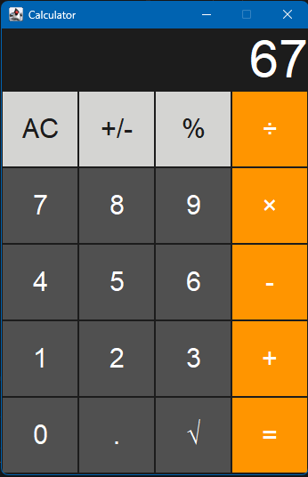

# Java Swing Calculator 🧮

A stylish desktop calculator application built with Java Swing and AWT, featuring a modern dark UI inspired by macOS.



## 🌟 Key Features
- **Standard Operations**: Addition (`+`), Subtraction (`-`), Multiplication (`×`), and Division (`÷`).
- **Special Functions**: Square Root (`√`), Percentage (`%`), and Sign Toggle (`+/-`).
- **Custom UI Styling**: Clean color scheme with distinct button hierarchy for numbers, top utilities, and operation triggers.
- **Clean Display Handling**: Automatically formats numbers to strip unnecessary decimal zeros for whole integers.

## 🛠️ Tech Stack
- **Java (JDK 8 or higher)** - Core programming language.
- **Java Swing & AWT** - Desktop Graphical User Interface (GUI) framework.

## 🚀 How to Run

### 1. Clone the repository
```bash
git clone [https://github.com/namoraomar56-rgb/java-swing-calculator.git](https://github.com/namoraomar56-rgb/java-swing-calculator.git)
cd java-swing-calculator
